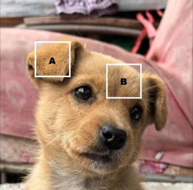
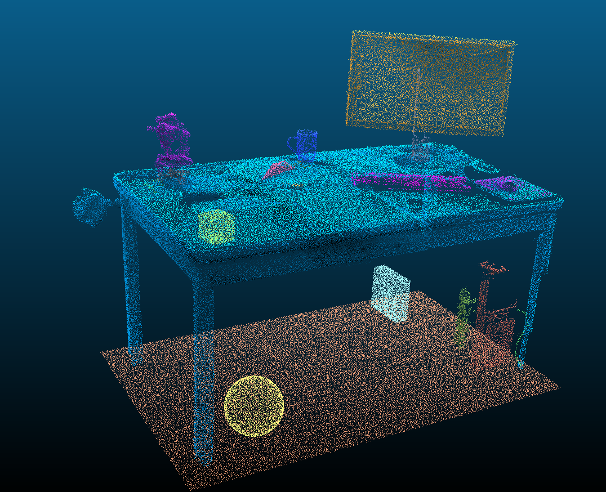
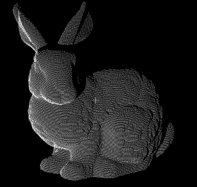
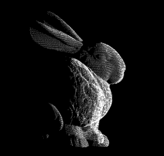
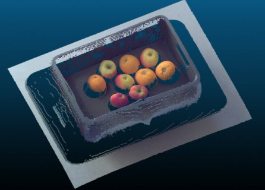

# What is a point cloud and its characteristics?

In our everyday world, ordinary photos are made up of many **pixels**, which form a two-dimensional grid. Each pixel is filled with RGB color values in its corresponding area, creating a complete 2D image.

## **Now imagine this🤯:**

Divide the 1 × 1 × 1 meter space around you into a huge number of tiny little cubes (like slicing the entire space into millions of microscopic building blocks).  
Then apply a simple replacement rule to these small cubes:

- If a small cube contains **any part of an object** (even just a tiny bit), replace it with **a single point** at that location.
- If the small cube contains only air, leave it empty — no point is created.

Because these tiny cubes are extremely small, the continuous surface of any object gets broken down into a large number of discrete points.When these massive discrete points become a set,they can be used to represent the three-dimensional shape of an object.
As a result, the object is recorded and represented as a collection of many points distributed in three-dimensional space.

This collection of points is what we call a **point cloud**.

## In short:  
**A point cloud is a set of discrete points in 3D space that together approximate the shape and surface of real-world objects.**

So the position of each points in the point cloud is described using the Cartesian coordinate system $(X,Y,Z)$,sometimes including color information $(R,G,B)$ and so on.

## Now let's start discussing the characteristics of point clouds

### 1. The disorder of point clouds
Swapping any two pixels blocks of a two-dimensional image disrupts the original ordered structure,leading to changes in semantic information as shown in the following **[Fig. 1](#fig:disorder)** and **[Fig. 2](#fig:disord2)**.

  <table border="0">
    <tr>
      <td align="center">
        
        
         
        <strong>Fig. 1.</strong> Original ordered structure
      </td>
      <td align="center">
        
        
         
        <strong>Fig. 2.</strong> Disordered after swapping
      </td>
    </tr>
  </table>

However,when you exchange the two points "A" and "B" in the point cloud,you will be suprised to find that the shape of point cloud and its semantics have not changed(Only considering that the points only contain coordinate information),which is completely different from the picture.

If you randomly select two points in **[Fig. 3](#fig:pointcloud)** and swap them,nothing will happend and everything will remain the same:the ground is still the ground,the table is still the table.

  <table border="0">
    <tr>
      <td align="center">
        
        
         
        <strong>Fig. 3.</strong> Point cloud dataset
      </td>
    </tr>
  </table>

### 2. The non-uniformity of point clouds
It's easy to understand that in the process of collecting data,objects closer to the sensor have a higher point cloud density,while objects farther away have a lower point cloud density.Moreover,due to the fact that mainstream collection techniques are based on light reflection,there are no points other than the surface of the object.

**It should noted that sensor can only see the side of the object facing it,and in a single data acquisition,the back and interior of the object are completely "vacuum zone".**

  <table border="0">
    <tr>
      <td align="center">
        
        
         
        <strong>Fig. 4.</strong> The side facing sensors
      </td>
      <td align="center">
        
        
         
        <strong>Fig. 5.</strong> The side not facing the sensor have a "vacuum zone"
      </td>
    </tr>
  </table>

### 3. Rotation and translation invariance
when you rotate or translate a point cloud,the coordinates of points will change,but the category and properties of the object will not change.

### 4. Contains multiple attributes
In public dataset,you usually see some colored point clouds because in basic $(X,Y,Z)$,point cloud can also carry other related information,such as intensity,color,normal vectors,etc.The introduction of these additional information also expands the methods of subsequent point cloud processing. 

  <table border="0">
    <tr>
      <td align="center">
        
        
         
        <strong>Fig. 6.</strong> Point cloud with color
      </td>
    </tr>
  </table>

At this point,everyone already knows the basic characteristics of point clouds,In next chapter,I will explain the I/O operations of point clouds **<ins>(which are actually available in the Open3D document library)</ins>**

So please refer to the offical documentation during the learning process:[[Open3D Doc]](https://www.open3d.org/docs/release/)